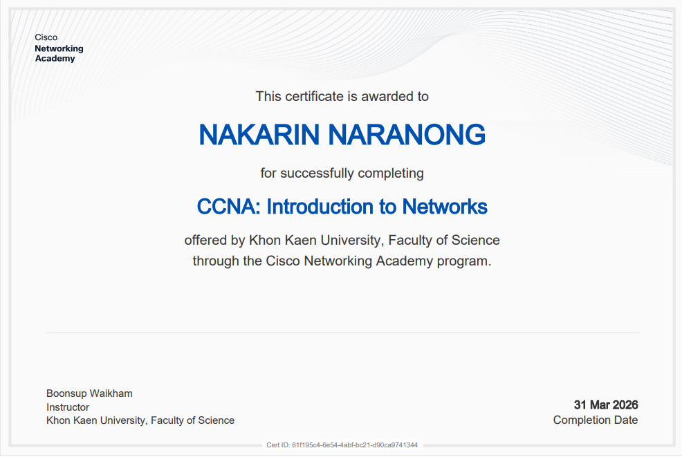

# Network-Portfolio
My portfolio for Computer Networks course (assignments, labs, projects)
# Network-Portfolio

**Name:** Nakarin Na ranong  
**Student ID:** 673380274-7 Section 02
**Email:** nakarin.nar@kkumail.com  

---

## 📁 Portfolio – Networks
This repository contains my assignments, labs, projects, and certificates related to Computer Networks.

---

##  Personal Assignment

| Assignment | Document Link | PDF File |
|-----------|--------------|----------|
| Essay | [Open Doc](https://docs.google.com/document/d/1ksDyrqSFE8xmVw11VJvwIYuPNMMFNr-uye68q09zl9o/edit?tab=t.0#heading=h.885aju1yttrj) | [Download PDF](./Assignment/Assignment1_673380274-7.pdf) |
| Assignment 2 (Topology) | [Open Doc](https://docs.google.com/document/d/1ZH5xawUpz1EkB-z9bbejrTmIQEnSLJqXCd6k-ro78oE/edit?tab=t.0) | [Download PDF](./Assignment/Assignment2.pdf) |
| Assignment 3 (Not Simple) | [📄 View File](https://drive.google.com/file/d/1HEjROHbK4-SLY4fIsH2XdlOYPAJvJvuL/view) | [Download PDF](./Assignment/Assignment3_673380274-7.pdf) |
| Assignment 4 (TCP-UDP) | [Open Doc](https://docs.google.com/document/d/1KSmagaT_uslgJp5S1DJWJv8Kc9ZIIWN2/edit) | [Download PDF](./Assignment/Assignment4.pdf) |
| Assignment 5 (LAB 5) | [Open Doc](https://docs.google.com/document/d/1EL2O5OzGDCcL9uff08EZI_qFdZ0oGWYo/edit) | [Download PDF](./Assignment/lab5,docx.pdf) |

---

## Labs 1–5

| Lab | Document Link | PDF File |
|-----|--------------|----------|
| Lab 1 | [Open Doc]() | [Download PDF](./Lab/lab_1_Network.pdf) |
| Lab 2 | [Open Doc]()  | [Download PDF](./Lab/Lab2.pdf) |
| Lab 3 | [Open Doc](https://docs.google.com/document/d/1jA_iFIHP4KY-toyaEddPGKTDxIYLtMWO/edit)  | [Download PDF](./Lab/lab3.pdf) |
| Lab 4 | [Open Doc]()  | [Download PDF](./Lab/lab4.pdf) |
| Sprint Alpha |[Open Doc]()  | [Download PDF](./Lab/Sprint_Alpha.pdf) |
---

## 🏆 Certificates

##  Final Project ##

  Omnitrix 

https://drive.google.com/drive/folders/1aAwZpMIqKKP_UVCQiY-7KBcqD3_JgEQr

---
